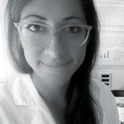
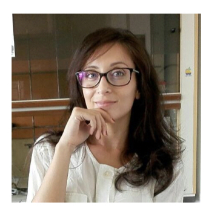

---

layout: page
title: People

---

#### Marco Piangerelli, Phd

Marco is a Postdoctoral Resarch Fellow in the Math Division in the School of Science and Techologies of University of Camerino. His research interest focus on data anlysis and machine learnig applied to biological problems.
https://marcopiangerelli.it

**email:** marco.piangerelli (at) unicam (dot) it

**twitter:** <a href="https://twitter.com/MPiangerelli" target="_blank">MPiangerelli </a>
   
**researchgate:** <a href="https://researchgate.net/profile/Marco_Piangerelli" target="_blank">Marco Piangerelli </a>

---

#### Laura Bordoni, Phd

Laura Bordoni is a Master of Science in Food and Nutrition Sciences and PhD in Molecular Biology and Cellular Biotechnology at University of Camerino, Italy. Her research is focused on the study of interactions between nutrients and the genome. She investigates how different genetic variants modulate personalized responses to food (nutrigenetics) and how  food and environmental stimuli affect the genome through epigenetic mechanisms (nutriepigenomics).  Currently, she is a post-doctoral researcher at Nutrigenomics Lab, University of Camerino, Italy.

**email:** laura.bordoni (at) unicam (dot) it

**researchgate:** <a href="https://www.researchgate.net/profile/Laura_Bordoni" target="_blank"> Laura Bordoni </a>

---

#### Federica Giusti, Phd

In 2018, Federica Giusti joined Janssen Pharmaceuticals, a pharmaceutical company of Johnson &amp;
Johnson as Postdoctoral Scientist.
In her role, Dr. Giusti is responsible for the implementation of new scientific strategies for dissolution
testing and for the design of efficient experiments to answer critical questions in drug product
development.
Prior to joining Janssen, Dr. Giusti worked in Germany at Pensatech Pharma GmbH, a spin off from
Freie Universität Berlin. In her role as Junior Scientist, she performed scientific analytical support in
both late and early drug product development.
Dr. Giusti received her Ph.D in Food Quality and Safety at University of Camerino, Italy. Her research
was focused on a comprehensive and multi-disciplinary approach to assess the nutritional factors
and health benefits of the most consumed pulses varieties.
During her academic career, she collaborated with Fertitecnica Colfiorito Srl (Perugia, Italy), for the
design of new lines of on-shelves healthy food and she joined multiple exchange programs,
performing her research in some of the most prestigious centers for Food Chemistry and Food Safety,
such as University of Wageningen (The Netherlands), Institute of Food Research (UK), and University
of Valencia (Spain).
Federica received her master’s degree in Pharmaceutical Chemistry and Technology and she is a
qualified Pharmacist (Pharm.D.) from the University of Camerino (Italy).Federica is 

**email:** federica.giusti (at) unicam (dot) it

**researchgate:** <a href="https://www.researchgate.net/profile/Federica_Giusti" target="_blank"> Federica Giusti </a>

